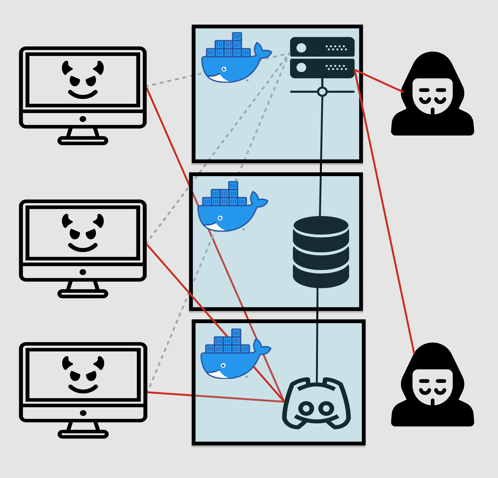

# unCEAN C2: Adversary Emulation Framework
The unCEAN C2 asynchronously awaits new implant registrations on the C2 Discord server. Discord is used to bypass traffic restrictions, anonymize traffic, and provide a defensive layer between the C2 and the implant. The implant is in a loop, regularly checking in for new commands, while updating symmetric keys upon its heartbeat.

## Two modes of operation
The unCEAN implant automatically decides between using the Discord Bot API or an HTTP fallback as its C2 channel.

## Execution
If Discord is unavailable, the implant will attempt to connect to the C2 over HTTPS.
Execution
The Implant supports a wide array of functionality
- Steals Chrome passwords, credit cards, autofill data, history, and cookie!
- Gathers information about the user - such as their username, and directories
- Spy on the network and grab IPs of other
systems by collecting adapter information
- Discover system information including the version, build, the system’s guid, and a list of processe!
- Executes processes via shell code injection and command line commands

# Architecture

## C2 server
- A Python Flask application dedicated to the client and HTTP fallback method
- A Python Discord Listener dedicated to handle implant messaging
- A MySQL database container

## Encryption
Hybrid cryptographic scheme:
- Elliptic Curve Cryptography (Asymmetric)
- Salsa20 (Symmetric)

## Implant 
- Implant written in C which utilizes the Win32 API

## Operator
- Python CLI Client for interacting with the C2

# Pivots and Future Work
## Brainstorming
Our goal for this project is to create an implant that would be more difficult to detect, especially on a busy network.

Upon investigating, we found the Discord Bot API to be an excellent way to move traffic between the infected machine and our C2 server.

Instead of an app making unusual connections, our implant looks like a chatty Discord user!

## Planning
We began planning our project by creating a desired set of functionalities, while exploring how to architecture the system to ideally serve those choices.

Next, we chose which tools to use when engineering our system: Flask, MySQL, C, and a dedicated Discord Listener. Other tools include Libsodium, Docker, and the Windows API.

## Implementation and Testing
After the planning phase, we began construction of our project’s components.

We used GitHub for managing our workflow, using GitHub actions for our CI flow.

Tests include testing our Docker containers for our Flask App, Discord Listener, and MySQL database, along with unit tests for our Flask endpoints.

## Expansion
After creating a prototype, we implemented features for gathering data about the user and the system.

We also continued to improve features of the implant by adding a process injection, as well as a persistence method for the implant to start on user logon.

We plan on further expanding our implant’s functionality.